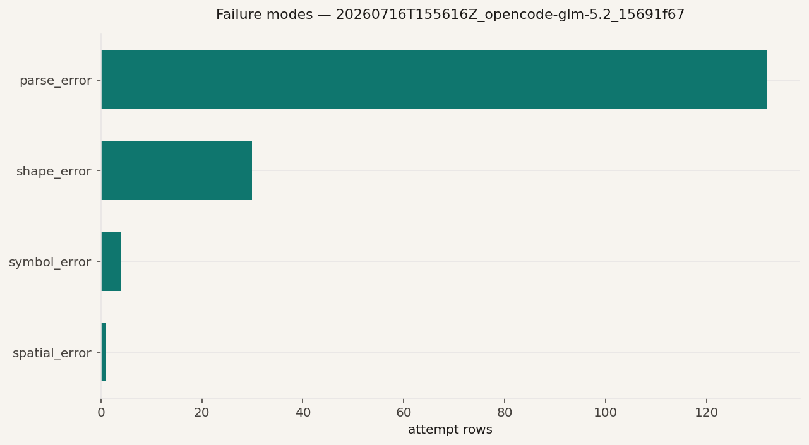
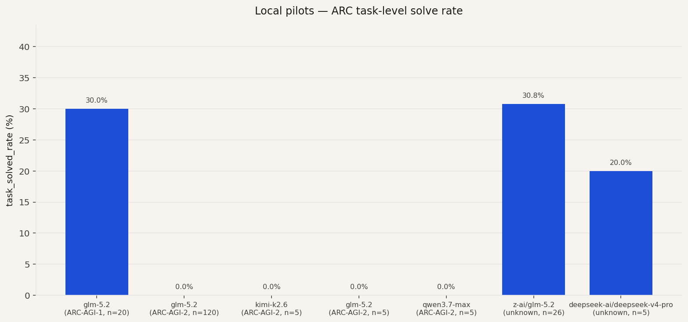
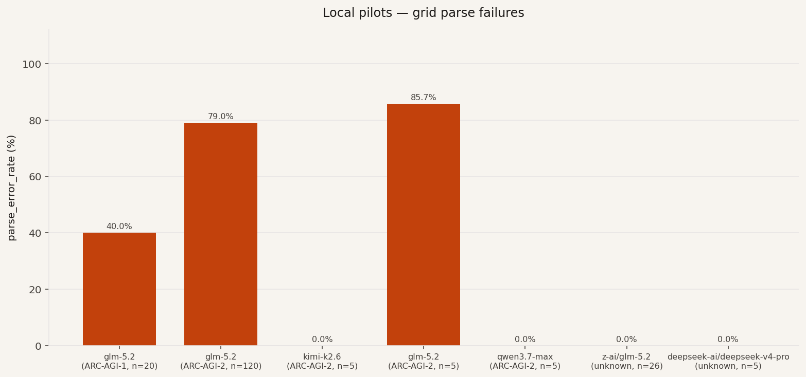
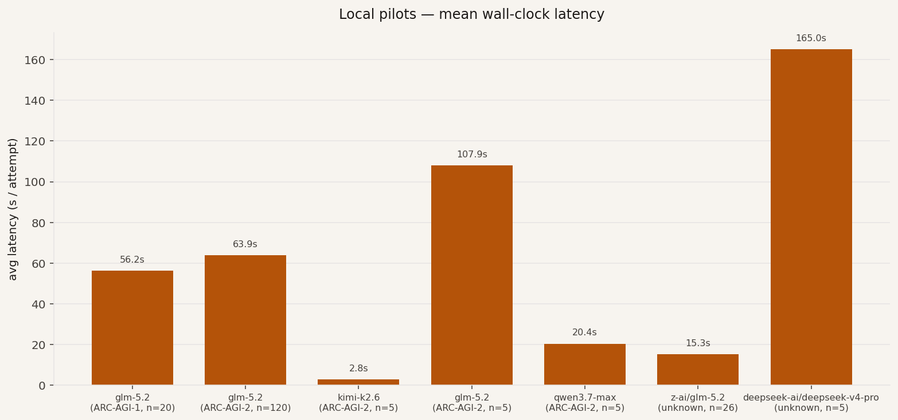

# ATLAS

**ARC Solver Evaluation Platform**

Open-source **local judge** for ARC-AGI solver research: versioned benchmark
packs, submission-first ingestion, reproducible analytics, optional public-score
context, and a static results UI.

> **Objective:** this repository is **evaluation infrastructure**, *not* a solver.
> It does not attempt to solve ARC tasks; it scores, categorizes, and compares the
> outputs of *other* solvers/models under one reproducible protocol.

**Testing your own solver?** Start here →
[**docs/EVALUATE_YOUR_SOLVER.md**](docs/EVALUATE_YOUR_SOLVER.md) (deploy → smoke →
full, step by step).

**Shipping a complete system to ARC Prize / Kaggle?** →
[**docs/PRESUBMIT_STANDARD.md**](docs/PRESUBMIT_STANDARD.md): run your whole
pipeline under the judge (`batch_runner`), Kaggle-strict format check, sealed
holdout, and a one-page go/no-go certificate (`make presubmit-example`).

**Contracts / install / adopter path:**
[`docs/CONTRACTS.md`](docs/CONTRACTS.md) ·
[`docs/REPRODUCIBILITY.md`](docs/REPRODUCIBILITY.md) ·
[`docs/ADOPTER_JOURNEY.md`](docs/ADOPTER_JOURNEY.md) ·
[`CHANGELOG.md`](CHANGELOG.md)

**Handoff guide:** [`docs/HANDOFF.md`](docs/HANDOFF.md) · **Evidence index:**
[`reports/README.md`](reports/README.md)

---

## What this is / what this is not

| This **is** | This **is not** |
| --- | --- |
| A reproducible evaluation **platform** for heterogeneous solvers | An ARC solver or training codebase |
| Submission-first (`submission.json` / prediction dir) | The official ARC Prize / Kaggle leaderboard |
| Local Parquet + manifests + failure taxonomy | A hosted SaaS (you run it locally) |
| Optional curated **observatory** for public-score **context** | Auto-download of licensed AGI-2 corpora |

---

## How it works (today)

```
benchmark pack / raw JSON
        →  src/main.py (ETL)  →  tasks Parquet + pack metadata
        →  src/run_evaluation.py  →  scored rows + run manifest
        →  src/build_analytics.py  →  CSVs + reports/*.md
        →  (optional) public_results_cli + export_frontend_data → UI JSON
```

- **Judge:** parsing, scoring, and taxonomy are solver-agnostic (Standard Solver
  Interface + adapters in `src/solvers.py`).
- **Benchmark packs:** `benchmark_packs/<pack_id>/manifest.json` + `tasks/`
  (`arc_agi_1`, `arc_agi_2`, `example_local_pack`). See
  [`docs/BENCHMARK_PACKS.md`](docs/BENCHMARK_PACKS.md).
- **Submission-first:** external authors validate and score artifacts via
  `src/submission_cli.py` — no core rewrite. See
  [`docs/QUICKSTART_EXTERNAL_SOLVER.md`](docs/QUICKSTART_EXTERNAL_SOLVER.md).
- **Observatory vs judge:** the judge scores **your** runs; the observatory
  ingests **curated public fixtures** for side-by-side context only
  (`comparison_scope=local_pilot_partial`). See
  [`docs/PUBLIC_RESULTS_OBSERVATORY.md`](docs/PUBLIC_RESULTS_OBSERVATORY.md).
- **Frontend:** `scripts/export_frontend_data.py` writes static
  `frontend/public/data/overview.json`; Vite serves it read-only. No backend.

**Scoring (Decision 21):** reports include `solved_rate` (per test example),
`task_solved_rate` (ARC-official per task), and `exact_match_rate` (per attempt).

---

## Results obtained (documented local pilots)

All figures below are **`local_pilot_partial`**: fixed task subsets, LLM-direct
pass@1 unless noted, **not** official ARC Prize leaderboard scores. Full
narratives: [`reports/`](reports/) · tables: [`reports/tables/`](reports/tables/) ·
charts: [`reports/figures/`](reports/figures/).

### Primary corpus run — ARC-AGI-2 public eval (n=120)

| Field | Value |
| --- | --- |
| Model | OpenCode Go `glm-5.2` (thinking disabled) |
| Pack | `arc_agi_2` — 120 tasks → **167** test items |
| Prompt / attempts | `arc_grid_v2` / 1 |
| Run id | `20260716T155616Z_opencode-glm-5.2_15691f67` |
| `task_solved_rate` | **0 / 120 (0%)** |
| `solved_rate` (items) | **0 / 167 (0%)** |
| Evaluable grids (parse ok) | 35 / 167 |
| Parse errors | **132 (79%)** |
| Avg latency | **~63.9 s / item** |
| Wall time | ~3.0 h |
| Report | [`reports/pilot_glm52_agi2_n120.md`](reports/pilot_glm52_agi2_n120.md) |

Attempt-level CSV: [`reports/tables/pilot_glm52_agi2_n120_attempts.csv`](reports/tables/pilot_glm52_agi2_n120_attempts.csv).



### Comparative table (selected pilots)

| Model | Benchmark | n tasks | n items | task_solved_rate | solved_rate | parse_error | avg latency |
| --- | --- | ---: | ---: | ---: | ---: | ---: | --- |
| glm-5.2 (OpenCode) | ARC-AGI-2 | 120 | 167 | 0.0% | 0.0% | 79.0% | 63.9s |
| glm-5.2 (OpenCode) | ARC-AGI-1 | 20 | 20 | 30.0% | 30.0% | 40.0% | 56.2s |
| z-ai/glm-5.2 (archive) | ARC-AGI-1-ish | 26 | 26 | 30.8% | 30.8% | 0.0% | 15.3s |
| deepseek-v4-pro (NIM) | ARC-AGI-1-ish | 5 | 5 | 20.0% | 20.0% | 0.0% | 165s |
| qwen3.7-max (OpenCode) | ARC-AGI-2 | 5 | 7 | 0.0% | 0.0% | **0.0%** | 20.4s |
| kimi-k2.6 (OpenCode) | ARC-AGI-2 | 5 | 5 | 0.0% | 0.0% | 0.0% | 2.8s |
| glm-5.2 smoke | ARC-AGI-2 | 5 | 7 | 0.0% | 0.0% | 85.7% | 107.9s |

Source CSV: [`reports/tables/model_comparison.csv`](reports/tables/model_comparison.csv).







### Methodological notes

1. **Protocol.** ETL stamps pack metadata → `run_evaluation.py` scores each
   `(task, test_example)` under the Standard Solver Interface →
   `build_analytics.py` emits Parquet/CSV/Markdown with Decision 21 metrics.
2. **Fairness.** Ground truth never leaves the judge (`to_wire()`). LLM-direct
   never sees `expected_output`.
3. **Pass@k.** These pilots use `--attempts 1` (pass@1). ARC-style pass@2 is
   available via `--attempts 2` but was not used here.
4. **AGI-2 vs AGI-1.** On AGI-1 subsets, GLM often produced parseable grids and
   non-zero solve rates (~30%). On the full AGI-2 public eval pack, the same
   gateway model mostly emitted prose reasoning → **parse_error**, so solve rate
   collapsed to 0% even though HTTP calls succeeded (0 `execution_error`).
5. **Interpretation.** Low AGI-2 scores here diagnose **output-format / model
   behavior under this prompt**, not a broken judge. Qwen/Kimi smokes (n=5)
   parsed cleanly but also scored 0% — harder tasks, not infrastructure failure.
6. **Regenerate charts.** After new runs:
   `python scripts/consolidate_pilot_evidence.py --primary-run-id <run_id>`.

---

## Ease-of-use rubric (solver developers)

Six dimensions, 1–5 each (total 6–30). Current self-assessment: **~24/30**.

| Dimension | Focus |
| --- | --- |
| Onboarding | Scored run without editing platform core |
| Benchmark pack setup | Pack by id or path; versioned manifest |
| Submission ingest | `submission.json` or prediction directory |
| Reproducibility | Manifests + deterministic offline mock path |
| Analytics | Taxonomy + benchmark metadata in reports |
| Observatory clarity | Local judge ≠ public observatory |

---

## Requirements

- Python **3.11+**
- Node.js **18+** (frontend only)
- Optional: OpenAI-compatible API key for LLM-direct pilots

```bash
git clone <this-repo>
cd arc-failure-atlas
python -m venv .venv && source .venv/bin/activate
# Preferred (installs console scripts: atlas-evaluate, atlas-presubmit, …):
pip install -e .
# Or requirements only (then use `python src/...` as below):
# pip install -r requirements.txt
cp .env.example .env    # optional; export vars yourself — not auto-loaded
```

Install modes: **clone + editable** for developers; **`python src/...`** remains
supported through 0.x. See [`docs/ADOPTER_JOURNEY.md`](docs/ADOPTER_JOURNEY.md).

---

## Quick start

### 1. Verify (offline, no keys)

```bash
make test                 # unit tests (CI)
make smoke                # isolated ETL → mock eval → analytics
make mvp-offline          # sample data → report
```

### 2. ARC-AGI-2 pack (local tasks)

Task JSON under `benchmark_packs/arc_agi_2/tasks/` is **gitignored** on fresh
clones. Official public evaluation set:

**https://github.com/arcprize/ARC-AGI-2** → `data/evaluation/`

License/use is your responsibility; this repo does **not** auto-download it.

```bash
cp /path/to/ARC-AGI-2/data/evaluation/*.json benchmark_packs/arc_agi_2/tasks/
# or: ln -sfn /abs/path/to/ARC-AGI-2/data/evaluation benchmark_packs/arc_agi_2/tasks

python src/main.py --benchmark-pack arc_agi_2
python src/main.py --list-benchmark-packs
```

ETL accumulates packs in the same Parquet tree; see
[`docs/BENCHMARK_PACKS.md`](docs/BENCHMARK_PACKS.md).

### 3. Evaluate your solver (preferred)

```bash
python src/submission_cli.py validate-submission \
  --path examples/external_solver/submission.json

# Scope smokes with --task-id; otherwise missing pack tasks → execution_error
# (coverage gap, not a broken judge). See docs/EVALUATE_YOUR_SOLVER.md.
python src/submission_cli.py evaluate-submission \
  --path path/to/your/submission.json \
  --solver-name my-system --experiment-id pre-submit \
  --task-id sample01,sample02

python src/build_analytics.py --experiment-id pre-submit
```

### 4. LLM-direct pilot (optional, manual)

```bash
export OPENAI_API_KEY="…"
export OPENAI_BASE_URL="https://opencode.ai/zen/go/v1"

python src/run_evaluation.py \
  --provider openai --model glm-5.2 \
  --prompt-version arc_grid_v2 \
  --benchmark-pack arc_agi_2 \
  --task-id <ids> --limit 5 \
  --experiment-id my-pilot
```

OpenCode Go model ids: `glm-5.2`, `qwen3.7-max`, `kimi-k2.6` (not `z-ai/…`
aliases). Default `--attempts` is **1**; pass@2 → `--attempts 2`.

### 5. Local dashboard (ephemeral)

This UI is the dashboard of **your clone**, not a hosted site. Start it when you
need it; stop with Ctrl+C.

```bash
python scripts/export_frontend_data.py --run-id <run_id>
cd frontend && npm install && npx vite   # http://localhost:5173
```

### 6. Public context (optional)

```bash
python src/public_results_cli.py compare --run-id <run_id>
```

---

## Release status (v0.1.0 candidate)

| Area | Status |
| --- | --- |
| Offline pipeline | Verified: `make test` (170), `make smoke` |
| Packaging / console scripts | Verified: `pip install -e .` → `atlas-*` |
| Public contracts / schemas | Frozen: `docs/CONTRACTS.md` + `schemas/` |
| Adopter path | Documented: `docs/ADOPTER_JOURNEY.md` |
| Benchmark packs + ETL | Verified; AGI-2 on local 120-task pack |
| Submission adapters | Verified via examples + tests |
| Kaggle-strict + `kaggle_score` | Verified (Tier 1) |
| Batch runner + certificate | Verified: `make presubmit-example` |
| Sealed holdout | Verified (Tier 3; one-shot reveal) |
| LLM-direct pilots | Documented in `reports/` + tables + figures |
| Full AGI-2 public pack (n=120) | **Done** — GLM-5.2 OpenCode Go (`pilot-glm52-agi2-n120`) |
| CI / GitHub Actions | Wired: `.github/workflows/ci.yml` |
| Governance | `CONTRIBUTING.md`, `SECURITY.md`, issue templates, `RELEASE_PROCESS.md` |
| Gemini / Claude live | **Manual** first-run still on checklist |

Details: [`docs/HANDOFF.md`](docs/HANDOFF.md) · [`docs/RELEASE_CHECKLIST.md`](docs/RELEASE_CHECKLIST.md) · [`CHANGELOG.md`](CHANGELOG.md)

---

## Make targets

| Target | Action |
| --- | --- |
| `make help` | List targets |
| `make test` / `make smoke` | Verification |
| `make mvp-offline` | Offline demo pipeline |
| `make list-packs` / `make list-solvers` | Discovery |
| `make etl-example-pack` | Bundled tiny pack ETL |
| `make validate-example-submission` | Example submission check |
| `make batch-example` / `make presubmit-example` | Pre-submit demo |
| `make clean-demo` | Remove generated batch/certificate/holdout files |
| `make create-holdout` | Seal a local holdout split |
| `make frontend-dev` | Export + Vite |
| `make public-results` | Observatory compare (default pilot id) |

Operator runbook: [`docs/RUNBOOK.md`](docs/RUNBOOK.md)

---

## Safety

- Never commit `.env`, API keys, or pack task corpora (`data/`, `benchmark_packs/*/tasks/*.json`).
- Local pilots ≠ public leaderboard scores.
- Design log: [`src/DECISIONS.md`](src/DECISIONS.md)

## License

See [`LICENSE`](LICENSE).
